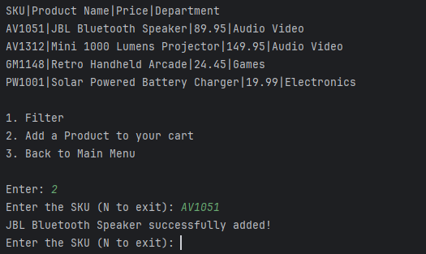

# Online Store

## Description of the Project

The Online Store program allows for a user to manually enter and view products from a .csv file. 
A **product** consists of:
- SKU
- Name 
- Price 
- Department

Multiple menus allow the user to organize their cart and check out those items.

## User Stories
> - As a user I want to be able to add items into my cart from a given list, so that I can purchase them all at the same time later.
> - As a user I want the inventory of the store to be loaded from my .csv file so that I can compile and purchase the items in the inventory.
> - As a user I want to be able to search for my products by name, price, and department, so that I can find the exact items I want within my specifications.
> - As a user I want to be able to see a products SKU, name, price, and department so I can assess all of the information and make a purchase.
> - As a user I want to be able to see all of the products available for purchase, so that I can see what's available in the inventory.
> - As a user I want to be able to navigate through organized menus so that I can easily understand where to purchase items, remove items, and checkout items.

## Setup

Instructions on how to set up and run the project using IntelliJ IDEA.

### Prerequisites

- IntelliJ IDEA: Ensure you have IntelliJ IDEA installed, which you can download from [here](https://www.jetbrains.com/idea/download/).
- Java SDK: Make sure Java SDK is installed and configured in IntelliJ.

### Running the Application in IntelliJ

Follow these steps to get your application running within IntelliJ IDEA:

1. Open IntelliJ IDEA.
2. Select "Open" and navigate to the directory where you cloned or downloaded the project.
3. After the project opens, wait for IntelliJ to index the files and set up the project.
4. Find the main class with the `public static void main(String[] args)` method.
5. Right-click on the file and select 'Run 'YourMainClassName.main()'' to start the application.

### Using a pre-made .csv file

In order to use a pre-made .csv file with transactions, the file must be named "products.csv" placed in the main program folder,
and the information needs to follow the format:
> SKU|Product Name|Price|Department

 
## Technologies Used

- IntelliJ IDEA 2023.3.3 (Ultimate Edition)
- Java 17 (Amazon Corretto 17.0.12)

## Demo
### Main Menu

### Show Products

## Unique Feature
My project uniquely combines the process of adding from a list and removing from a list using the promptItems() method.

## Future Work

- Update checkout to include more information
- Create Sales Receipt
- Show quantity of items to purchase
- Inline Comments and Documentation

## Resources
Workbook 3

## Thanks

Thank you to Raymond Maroun for continuous support and guidance & skeleton code.